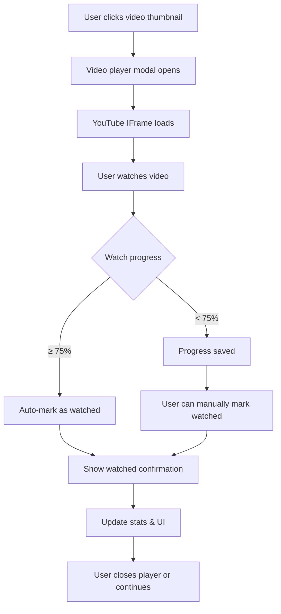

# Embedded Video Player with Auto-Watch Tracking

## Table of Contents
- [Overview](#overview)
- [Problem Statement](#problem-statement)
- [Solution Overview](#solution-overview)
- [Current System Analysis](#current-system-analysis)
- [Technical Design](#technical-design)
  - [Database Schema Changes](#database-schema-changes)
  - [Backend API Design](#backend-api-design)
  - [Frontend Architecture](#frontend-architecture)
  - [YouTube IFrame Player Integration](#youtube-iframe-player-integration)
  - [Watch Progress Tracking](#watch-progress-tracking)
  - [URL State Management](#url-state-management)
  - [Internationalization](#internationalization)
- [Implementation Phases](#implementation-phases)
- [Performance Considerations](#performance-considerations)
- [Testing Strategy](#testing-strategy)
- [Risks and Mitigation](#risks-and-mitigation)
- [Conclusion](#conclusion)

## Overview

This feature adds an embedded YouTube video player to the application, allowing users to watch videos without leaving the site. It includes intelligent watch status tracking that automatically marks videos as watched when 75% of the video has been viewed, with the option to manually mark videos as watched during playback.

## Problem Statement

**Current Pain Points:**
1. **Friction in Video Consumption**: Users must leave the application to watch videos on YouTube, breaking their browsing flow
2. **Manual Watch Tracking**: Users must remember to manually mark videos as watched after viewing them externally
3. **No Progress Tracking**: The system has no awareness of actual viewing progress, only binary watched/unwatched status
4. **Lost Context**: When opening videos externally, users lose the gallery context (tags, channel info, related videos)
5. **Inefficient Workflow**: Users must switch between YouTube and the gallery app to manage their video queue

## Solution Overview

**Key Capabilities:**
- **Embedded YouTube Player**: Full-featured video player integrated within the application using YouTube IFrame Player API
- **Automatic Watch Detection**: Videos are automatically marked as watched when 75% of the content has been viewed
- **Manual Watch Control**: Users can manually mark videos as watched during playback via an in-player button
- **Progress Persistence**: Watch progress is saved and can be resumed if the user returns to the video
- **Seamless Integration**: Player integrates with existing watch status, notes, and tag systems
- **Responsive Design**: Player works on desktop and mobile with appropriate controls

**User Experience Flow:**


## Current System Analysis

### Existing Architecture

**Frontend Video Display** ([VideoCard.tsx](frontend/app/videos/components/VideoCard.tsx)):
- Videos displayed as cards with thumbnails
- Clicking thumbnail opens video in new YouTube tab
- Manual watch toggle button with notes functionality
- Watch status stored per user via `UserVideo` relationship

**Backend Watch Status** ([users/models.py:69-87](backend/users/models.py#L69-L87)):
```python
class UserVideo(TimestampMixin):
    id = models.UUIDField(primary_key=True, default=uuid.uuid4, editable=False)
    user = models.ForeignKey(settings.AUTH_USER_MODEL, on_delete=models.CASCADE)
    video = models.ForeignKey("videos.Video", on_delete=models.CASCADE)
    is_watched = models.BooleanField(default=False)
    watched_at = models.DateTimeField(null=True, blank=True)
    is_not_interested = models.BooleanField(null=True, blank=True, default=None)
    not_interested_at = models.DateTimeField(null=True, blank=True)
    notes = models.TextField(blank=True, null=True)
```

**Watch Status API** ([videos/views.py:127-156](backend/videos/views.py#L127-L156)):
- Endpoint: `PUT /api/videos/{id}/watch`
- Accepts: `is_watched` (boolean), `notes` (string)
- Sets `watched_at` timestamp when marked as watched
- Returns: `status`, `is_watched`, `watched_at`, `notes`

**Frontend Video Types** ([frontend/types.ts:71-90](frontend/types.ts#L71-L90)):
```typescript
export interface Video {
  uuid: string;
  video_id: string;           // YouTube video ID
  channel_title: string;
  title: string;
  duration: string | null;     // ISO 8601 duration format (PT1H2M3S)
  thumbnail_url: string;
  video_url: string;           // Full YouTube URL
  is_watched: boolean;
  watched_at: string | null;
  notes: string | null;
  // ... other fields
}
```

### Key Insights

1. **Watch Status Foundation**: Robust user-video tracking already exists with timestamps
2. **No Progress Tracking**: Current system only tracks binary watched/unwatched, not playback position
3. **Duration Available**: Video duration stored in ISO 8601 format, can calculate 75% threshold
4. **API Ready**: Watch status endpoint can be extended for progress updates
5. **YouTube ID Extraction**: `video_id` field contains the YouTube video ID needed for IFrame API

## Technical Design

### Database Schema Changes

#### 1. User Preferences Model

Add user-level preferences for auto-watch behavior:

```python
# backend/users/models.py

class UserWatchPreferences(TimestampMixin):
    """User preferences for automatic watch tracking"""

    id = models.UUIDField(primary_key=True, default=uuid.uuid4, editable=False)
    user = models.OneToOneField(
        settings.AUTH_USER_MODEL,
        on_delete=models.CASCADE,
        related_name="watch_preferences"
    )

    # Auto-mark preferences
    auto_mark_watched_enabled = models.BooleanField(
        default=True,
        help_text="Enable automatic marking of videos as watched"
    )
    auto_mark_threshold = models.IntegerField(
        default=75,
        help_text="Percentage threshold for auto-marking (0-100)",
        validators=[MinValueValidator(0), MaxValueValidator(100)]
    )

    class Meta:
        db_table = "user_watch_preferences"
        verbose_name_plural = "user watch preferences"

    def __str__(self) -> str:
        return f"Watch preferences for {self.user.email}"
```

#### 2. Video Progress Tracking

Add watch progress tracking to `UserVideo` model:

```python
# backend/users/models.py

class UserVideo(TimestampMixin):
    # ... existing fields ...

    # New fields for progress tracking
    watch_progress_seconds = models.IntegerField(
        default=0,
        help_text="Current playback position in seconds"
    )
    auto_marked_watched = models.BooleanField(
        default=False,
        help_text="True if automatically marked as watched via threshold"
    )

    class Meta:
        db_table = "user_videos"
        unique_together = ("user", "video")
        indexes = [
            models.Index(fields=["user", "is_not_interested"], name="user_not_interested_idx"),
            # Index for finding videos in progress
            models.Index(fields=["user", "watch_progress_seconds"], name="user_watch_progress_idx"),
        ]

    @property
    def watch_percentage(self) -> float:
        """Calculate watch percentage based on video duration and current progress"""
        if not self.video or not self.video.duration:
            return 0.0

        # Convert ISO 8601 duration to seconds
        duration_seconds = self.video.duration.total_seconds()
        if duration_seconds <= 0:
            return 0.0

        return min((self.watch_progress_seconds / duration_seconds) * 100, 100.0)
```

**Design Rationale:**

1. **User preferences are configurable** - Each user can control auto-mark behavior independently
2. **Threshold is adjustable** - Users can set their preferred completion percentage (50%, 75%, 90%, etc.)
3. **Video duration is in Video model** - The `Video.duration` field (YouTubeDurationField) already stores video length in ISO 8601 format (e.g., "PT1H2M3S")
4. **Watch percentage is calculated** - Computed as a property from `watch_progress_seconds / video.duration`, not stored
5. **Single source of truth** - Duration lives in `Video` model where it belongs, preventing data duplication
6. **Database normalization** - No redundant data that could become inconsistent

**Migration Considerations:**
- Create `user_watch_preferences` table with default values
- Auto-create preferences for existing users with defaults: `auto_mark_watched_enabled=True`, `auto_mark_threshold=75`
- Add `watch_progress_seconds` with default value 0 for backward compatibility
- Add `auto_marked_watched` boolean field with default False
- Existing records will have `watch_progress_seconds=0`
- `auto_marked_watched=False` for all existing watched videos
- No `watch_percentage` column needed (calculated property)

### Backend API Design

#### 1. Update Watch Progress Endpoint

**New Endpoint**: `PUT /api/videos/{uuid}/watch-progress`

**Purpose**: Update watch progress during playback without marking as watched

**Request Body**:
```python
# backend/videos/validators.py
from pydantic import BaseModel, Field

class WatchProgressUpdateParams(BaseModel):
    current_time: float = Field(..., ge=0, description="Current playback position in seconds")
    duration: float = Field(..., gt=0, description="Total video duration in seconds")
    auto_mark: bool = Field(default=True, description="Auto-mark as watched at 75%")
```

**Response**:
```json
{
  "status": "success",
  "watch_progress_seconds": 450,
  "watch_percentage": 75.0,
  "is_watched": true,
  "auto_marked": true,
  "message": "Video automatically marked as watched"
}
```

**Implementation** ([videos/views.py](backend/videos/views.py)):
```python
@action(detail=True, methods=["put"], url_path="watch-progress")
def update_watch_progress(self, request: Request, pk: Any = None) -> Response:
    """Update video watch progress and auto-mark based on user preferences"""
    video = self.get_object()
    user = cast(User, request.user)

    params = WatchProgressUpdateParams.from_request(request)

    # Get user's watch preferences (or create with defaults)
    preferences, _ = UserWatchPreferences.objects.get_or_create(
        user=user,
        defaults={
            "auto_mark_watched_enabled": True,
            "auto_mark_threshold": 75,
        }
    )

    # Calculate watch percentage from frontend-provided duration
    watch_percentage = (params.current_time / params.duration) * 100

    user_video, created = UserVideo.objects.get_or_create(
        user=user,
        video=video,
        defaults={
            "watch_progress_seconds": int(params.current_time),
        }
    )

    # Update progress
    user_video.watch_progress_seconds = int(params.current_time)

    # Auto-mark as watched using user's preferences
    auto_marked = False
    if (params.auto_mark and
        preferences.auto_mark_watched_enabled and
        watch_percentage >= preferences.auto_mark_threshold and
        not user_video.is_watched):
        user_video.is_watched = True
        user_video.watched_at = timezone.now()
        user_video.auto_marked_watched = True
        auto_marked = True

    user_video.save()

    return Response({
        "status": "success",
        "watch_progress_seconds": user_video.watch_progress_seconds,
        "watch_percentage": round(watch_percentage, 2),
        "is_watched": user_video.is_watched,
        "auto_marked": auto_marked,
        "threshold": preferences.auto_mark_threshold,
        "message": f"Video automatically marked as watched at {preferences.auto_mark_threshold}%" if auto_marked else "Progress updated"
    })
```

**Implementation Notes:**

- **User preferences respected**: Checks `auto_mark_watched_enabled` and uses `auto_mark_threshold` from user preferences
- **Frontend sends duration**: The client knows the actual video duration from YouTube IFrame API, sends it with each update
- **Backend calculates percentage**: For auto-mark threshold check
- **Configurable threshold**: Uses user's preferred threshold (default 75%)
- **Property unused during write**: The `watch_percentage` property is used for reads (serializers), not during progress updates
- **Simpler storage**: Only stores `watch_progress_seconds`, everything else is derived

#### 2. Enhance Watch Status Endpoint

Update existing `PUT /api/videos/{uuid}/watch` to preserve progress data:

```python
@action(detail=True, methods=["put"])
def watch(self, request: Request, pk: Any = None) -> Response:
    video = self.get_object()
    user = cast(User, request.user)

    is_watched = request.data.get("is_watched", True)
    notes = request.data.get("notes", "")

    user_video, created = UserVideo.objects.get_or_create(
        user=user, video=video, defaults={"is_watched": is_watched, "notes": notes}
    )

    if not created:
        user_video.is_watched = is_watched
        user_video.notes = notes
        if is_watched and not user_video.watched_at:
            user_video.watched_at = timezone.now()
            # Don't set auto_marked_watched since this is manual
        user_video.save()
    elif is_watched:
        user_video.watched_at = timezone.now()
        user_video.save()

    return Response({
        "status": "success",
        "is_watched": user_video.is_watched,
        "watched_at": user_video.watched_at,
        "notes": user_video.notes,
        "watch_progress_seconds": user_video.watch_progress_seconds,
        "watch_percentage": user_video.watch_percentage,  # Calculated property
    })
```

#### 3. Get Watch Progress Endpoint

**New Endpoint**: `GET /api/videos/{uuid}/watch-progress`

**Purpose**: Retrieve saved watch progress for resuming playback

**Response**:
```json
{
  "watch_progress_seconds": 450,
  "watch_percentage": 75.0,
  "is_watched": true,
  "auto_marked_watched": true
}
```

**Implementation**:
```python
@action(detail=True, methods=["get"], url_path="watch-progress")
def get_watch_progress(self, request: Request, pk: Any = None) -> Response:
    """Get watch progress for a video"""
    video = self.get_object()
    user = cast(User, request.user)

    try:
        user_video = UserVideo.objects.get(user=user, video=video)
        return Response({
            "watch_progress_seconds": user_video.watch_progress_seconds,
            "watch_percentage": user_video.watch_percentage,
            "is_watched": user_video.is_watched,
            "auto_marked_watched": user_video.auto_marked_watched,
        })
    except UserVideo.DoesNotExist:
        return Response({
            "watch_progress_seconds": 0,
            "watch_percentage": 0.0,
            "is_watched": False,
            "auto_marked_watched": False,
        })
```

#### 4. User Preferences Endpoints

**New Endpoints**: Manage user watch preferences

**GET /api/auth/watch-preferences**

Get current user's watch preferences:

```python
@api_view(["GET"])
@permission_classes([permissions.IsAuthenticated])
def get_watch_preferences(request: Request) -> Response:
    """Get user's watch preferences"""
    user = cast(User, request.user)

    preferences, _ = UserWatchPreferences.objects.get_or_create(
        user=user,
        defaults={
            "auto_mark_watched_enabled": True,
            "auto_mark_threshold": 75,
        }
    )

    return Response({
        "auto_mark_watched_enabled": preferences.auto_mark_watched_enabled,
        "auto_mark_threshold": preferences.auto_mark_threshold,
    })
```

**PUT /api/auth/watch-preferences**

Update user's watch preferences:

```python
# backend/users/validators.py
class WatchPreferencesParams(BaseModel):
    auto_mark_watched_enabled: bool = Field(..., description="Enable/disable auto-marking")
    auto_mark_threshold: int = Field(..., ge=0, le=100, description="Threshold percentage (0-100)")

@api_view(["PUT"])
@permission_classes([permissions.IsAuthenticated])
def update_watch_preferences(request: Request) -> Response:
    """Update user's watch preferences"""
    user = cast(User, request.user)
    params = WatchPreferencesParams.from_request(request)

    preferences, _ = UserWatchPreferences.objects.get_or_create(
        user=user,
        defaults={
            "auto_mark_watched_enabled": params.auto_mark_watched_enabled,
            "auto_mark_threshold": params.auto_mark_threshold,
        }
    )

    preferences.auto_mark_watched_enabled = params.auto_mark_watched_enabled
    preferences.auto_mark_threshold = params.auto_mark_threshold
    preferences.save()

    return Response({
        "status": "success",
        "auto_mark_watched_enabled": preferences.auto_mark_watched_enabled,
        "auto_mark_threshold": preferences.auto_mark_threshold,
        "message": "Watch preferences updated successfully"
    })
```

#### 5. Update Video List Serializer

Include progress data in video list responses:

```python
# backend/videos/serializers.py

class VideoListSerializer(serializers.ModelSerializer):
    # ... existing fields ...
    watch_progress_seconds = serializers.SerializerMethodField()
    watch_percentage = serializers.SerializerMethodField()

    def get_watch_progress_seconds(self, obj: Video) -> int:
        """Get saved playback position from UserVideo"""
        user_videos = getattr(obj, "_prefetched_user_videos", [])
        if user_videos:
            return user_videos[0].watch_progress_seconds
        return 0

    def get_watch_percentage(self, obj: Video) -> float:
        """Calculate watch percentage using UserVideo.watch_percentage property"""
        user_videos = getattr(obj, "_prefetched_user_videos", [])
        if user_videos:
            # Uses the @property method which calculates from video duration
            return round(user_videos[0].watch_percentage, 2)
        return 0.0
```

**Serializer Benefits:**

- **Uses calculated property**: `watch_percentage` comes from the `@property` method
- **No database column needed**: Percentage computed on-the-fly from `watch_progress_seconds` and `video.duration`
- **Prefetch optimization**: Leverages existing prefetch pattern for performance
- **Type safety**: Returns consistent float values

### Frontend Architecture

#### 1. TypeScript Types

Update video types to include progress tracking:

```typescript
// frontend/types.ts

export interface Video {
  // ... existing fields ...
  watch_progress_seconds?: number;
  watch_percentage?: number;
  auto_marked_watched?: boolean;
}

export interface VideoPlayerState {
  isOpen: boolean;
  video: Video | null;
  startTime?: number;
}

export interface WatchProgressUpdate {
  current_time: number;
  duration: number;
  auto_mark: boolean;
}

export interface WatchProgressResponse {
  status: string;
  watch_progress_seconds: number;
  watch_percentage: number;
  is_watched: boolean;
  auto_marked: boolean;
  message: string;
}
```

#### 2. Video Player Component

Create embedded player component using YouTube IFrame API:

**Component Class Naming Convention:**

Following the existing codebase pattern (as seen in `VideoCard.tsx`), use descriptive BEM-style class names with component prefix:

- Root element: `VideoPlayer`
- Child elements: `VideoPlayer__overlay`, `VideoPlayer__header`, `VideoPlayer__container`, etc.
- Modifiers: Use Tailwind utility classes for states and variants

This enables:
- Easy debugging with descriptive selectors in DevTools
- Better test targeting with `.VideoPlayer__element` selectors
- Consistent naming across the codebase

```typescript
// frontend/components/player/VideoPlayer.tsx

'use client';

import { useEffect, useRef, useState, useCallback } from 'react';
import { useTranslation } from 'react-i18next';
import { Video } from '@/types';
import { X, Check, RotateCcw } from 'lucide-react';
import { useVideoPlayer } from '@/hooks/useVideoPlayer';

interface VideoPlayerProps {
  video: Video;
  onClose: () => void;
  onWatchStatusChange: (isWatched: boolean) => void;
}

export function VideoPlayer({ video, onClose, onWatchStatusChange }: VideoPlayerProps) {
  const { t } = useTranslation('player');
  const playerRef = useRef<YT.Player | null>(null);
  const containerRef = useRef<HTMLDivElement>(null);
  const [isReady, setIsReady] = useState(false);
  const [currentTime, setCurrentTime] = useState(0);
  const [duration, setDuration] = useState(0);
  const [isWatched, setIsWatched] = useState(video.is_watched);

  const {
    updateProgress,
    markAsWatched,
    isUpdatingProgress,
    isMarkingWatched,
  } = useVideoPlayer(video.uuid);

  // Extract YouTube video ID from video_id or video_url
  const getYouTubeVideoId = useCallback(() => {
    return video.video_id;
  }, [video.video_id]);

  // Initialize YouTube IFrame API
  useEffect(() => {
    // Load YouTube IFrame API script if not already loaded
    if (!window.YT) {
      const tag = document.createElement('script');
      tag.src = 'https://www.youtube.com/iframe_api';
      const firstScriptTag = document.getElementsByTagName('script')[0];
      firstScriptTag.parentNode?.insertBefore(tag, firstScriptTag);
    }

    // Initialize player when API is ready
    const initPlayer = () => {
      if (!containerRef.current) return;

      playerRef.current = new window.YT.Player(containerRef.current, {
        videoId: getYouTubeVideoId(),
        playerVars: {
          autoplay: 1,
          start: video.watch_progress_seconds || 0,
          rel: 0, // Don't show related videos from other channels
          modestbranding: 1,
        },
        events: {
          onReady: (event) => {
            setIsReady(true);
            setDuration(event.target.getDuration());
          },
          onStateChange: handlePlayerStateChange,
        },
      });
    };

    if (window.YT && window.YT.Player) {
      initPlayer();
    } else {
      window.onYouTubeIframeAPIReady = initPlayer;
    }

    return () => {
      playerRef.current?.destroy();
    };
  }, [video.video_id, video.watch_progress_seconds, getYouTubeVideoId]);

  // Track playback progress
  useEffect(() => {
    if (!isReady || !playerRef.current) return;

    const interval = setInterval(() => {
      const player = playerRef.current;
      if (!player || typeof player.getCurrentTime !== 'function') return;

      const current = player.getCurrentTime();
      const total = player.getDuration();

      setCurrentTime(current);

      // Update progress every 10 seconds
      if (Math.floor(current) % 10 === 0) {
        updateProgress({
          current_time: current,
          duration: total,
          auto_mark: true,
        }).then((response) => {
          if (response.data?.auto_marked && !isWatched) {
            setIsWatched(true);
            onWatchStatusChange(true);
          }
        });
      }
    }, 1000);

    return () => clearInterval(interval);
  }, [isReady, updateProgress, isWatched, onWatchStatusChange]);

  const handlePlayerStateChange = (event: YT.OnStateChangeEvent) => {
    // Handle player state changes if needed
    if (event.data === window.YT.PlayerState.ENDED) {
      // Mark as watched when video ends
      if (!isWatched) {
        handleMarkAsWatched();
      }
    }
  };

  const handleMarkAsWatched = async () => {
    const response = await markAsWatched(true);
    if (response.data?.is_watched) {
      setIsWatched(true);
      onWatchStatusChange(true);
    }
  };

  const watchPercentage = duration > 0 ? (currentTime / duration) * 100 : 0;

  return (
    <div className="VideoPlayer fixed inset-0 z-50 bg-black/90 flex items-center justify-center p-4">
      <div className="VideoPlayer__modal relative w-full max-w-6xl bg-black rounded-lg overflow-hidden">
        {/* Header */}
        <div className="VideoPlayer__header absolute top-0 left-0 right-0 z-10 bg-gradient-to-b from-black/80 to-transparent p-4 flex items-start justify-between">
          <div className="VideoPlayer__info flex-1 pr-4">
            <h2 className="VideoPlayer__title text-white text-lg font-semibold line-clamp-2">
              {video.title}
            </h2>
            <p className="VideoPlayer__channel text-gray-300 text-sm mt-1">{video.channel_title}</p>
          </div>

          <button
            onClick={onClose}
            className="VideoPlayer__close text-white hover:text-gray-300 transition-colors flex-shrink-0"
            aria-label={t('closePlayer')}
          >
            <X className="VideoPlayer__close-icon w-6 h-6" />
          </button>
        </div>

        {/* Player Container */}
        <div className="VideoPlayer__container relative pt-[56.25%]">
          <div
            ref={containerRef}
            className="VideoPlayer__iframe absolute inset-0"
            id={`player-${video.uuid}`}
          />
        </div>

        {/* Controls Overlay */}
        <div className="VideoPlayer__controls absolute bottom-0 left-0 right-0 bg-gradient-to-t from-black/80 to-transparent p-4">
          {/* Progress Bar */}
          <div className="VideoPlayer__progress mb-4">
            <div className="VideoPlayer__progress-track w-full bg-gray-700 h-1 rounded-full overflow-hidden">
              <div
                className="VideoPlayer__progress-bar bg-red-600 h-full transition-all duration-300"
                style={{ width: `${watchPercentage}%` }}
              />
            </div>
            <div className="VideoPlayer__progress-info flex justify-between text-xs text-gray-400 mt-1">
              <span className="VideoPlayer__progress-text">{Math.floor(watchPercentage)}% watched</span>
              {watchPercentage >= 75 && !isWatched && (
                <span className="VideoPlayer__progress-hint text-yellow-400">{t('almostDone')}</span>
              )}
            </div>
          </div>

          {/* Action Buttons */}
          <div className="VideoPlayer__actions flex items-center gap-3">
            {!isWatched ? (
              <button
                onClick={handleMarkAsWatched}
                disabled={isMarkingWatched}
                className="VideoPlayer__watch-button flex items-center gap-2 px-4 py-2 bg-green-600 hover:bg-green-700 disabled:bg-gray-600 text-white rounded-lg transition-colors"
              >
                <Check className="VideoPlayer__watch-icon w-4 h-4" />
                {isMarkingWatched ? t('marking') : t('markAsWatched')}
              </button>
            ) : (
              <div className="VideoPlayer__watched-badge flex items-center gap-2 px-4 py-2 bg-green-600/20 text-green-400 rounded-lg">
                <Check className="VideoPlayer__watched-icon w-4 h-4" />
                {t('watched')}
              </div>
            )}

            {video.watch_progress_seconds > 0 && (
              <button
                onClick={() => playerRef.current?.seekTo(0, true)}
                className="VideoPlayer__restart-button flex items-center gap-2 px-4 py-2 bg-gray-700 hover:bg-gray-600 text-white rounded-lg transition-colors"
              >
                <RotateCcw className="VideoPlayer__restart-icon w-4 h-4" />
                {t('restart')}
              </button>
            )}
          </div>
        </div>
      </div>
    </div>
  );
}
```

#### 3. Video Player Hook

Create custom hook for player logic:

```typescript
// frontend/hooks/useVideoPlayer.ts

import { useMutation, useQueryClient } from '@tanstack/react-query';
import { updateVideoWatchProgress, updateVideoWatchStatus } from '@/services/videos';
import { queryKeys } from '@/lib/reactQueryConfig';
import { WatchProgressUpdate } from '@/types';

export function useVideoPlayer(videoId: string) {
  const queryClient = useQueryClient();

  const { mutateAsync: updateProgress, isPending: isUpdatingProgress } = useMutation({
    mutationFn: (data: WatchProgressUpdate) => updateVideoWatchProgress(videoId, data),
    onSuccess: (response) => {
      // Only invalidate if auto-marked
      if (response.data?.auto_marked) {
        queryClient.invalidateQueries({ queryKey: queryKeys.videos });
        queryClient.invalidateQueries({ queryKey: queryKeys.videoStats });
      }
    },
  });

  const { mutateAsync: markAsWatched, isPending: isMarkingWatched } = useMutation({
    mutationFn: (isWatched: boolean) => updateVideoWatchStatus(videoId, isWatched),
    onSuccess: () => {
      queryClient.invalidateQueries({ queryKey: queryKeys.videos });
      queryClient.invalidateQueries({ queryKey: queryKeys.videoStats });
    },
  });

  return {
    updateProgress,
    markAsWatched,
    isUpdatingProgress,
    isMarkingWatched,
  };
}
```

#### 4. Video Services

Add new service methods:

```typescript
// frontend/services/videos.ts

export interface WatchProgressUpdate {
  current_time: number;
  duration: number;
  auto_mark: boolean;
}

export interface WatchProgressResponse {
  status: string;
  watch_progress_seconds: number;
  watch_percentage: number;
  is_watched: boolean;
  auto_marked: boolean;
  message: string;
}

export async function updateVideoWatchProgress(
  videoId: string,
  data: WatchProgressUpdate
): Promise<ApiResponse<WatchProgressResponse>> {
  const response = await fetch(`${API_BASE_URL}/videos/${videoId}/watch-progress`, {
    ...getRequestOptions(),
    method: 'PUT',
    body: JSON.stringify(data),
  });
  return ResponseHandler.handle<WatchProgressResponse>(response);
}

export async function getVideoWatchProgress(
  videoId: string
): Promise<ApiResponse<WatchProgressResponse>> {
  const response = await fetch(
    `${API_BASE_URL}/videos/${videoId}/watch-progress`,
    getRequestOptions()
  );
  return ResponseHandler.handle<WatchProgressResponse>(response);
}
```

#### 5. Update VideoCard Component

Modify VideoCard to open player instead of external link:

**Note:** The existing `VideoCard.tsx` already follows BEM naming convention. Maintain consistency when adding new elements.

```typescript
// frontend/app/videos/components/VideoCard.tsx

// Add to props
interface VideoCardProps {
  video: Video;
  onWatch: () => void;  // Now opens player instead of external link
  onToggleWatched: (isWatched: boolean, notes?: string) => void;
  onToggleNotInterested: (isNotInterested: boolean) => void;
  notInterestedFilter: NotInterestedFilter;
}

// Update thumbnail click handler
<a
  onClick={(e) => {
    e.preventDefault();
    onWatch();  // Opens player modal
  }}
  className="VideoCard__thumbnail w-full h-48 relative overflow-hidden rounded-md block cursor-pointer group/thumbnail"
>
  {/* ... existing content ... */}

  {/* Add progress indicator with BEM naming */}
  {video.watch_percentage > 0 && video.watch_percentage < 100 && (
    <div className="VideoCard__progress-indicator absolute bottom-0 left-0 right-0 h-1 bg-gray-300">
      <div
        className="VideoCard__progress-bar h-full bg-red-600"
        style={{ width: `${video.watch_percentage}%` }}
      />
    </div>
  )}
</a>
```

**BEM Class Additions:**
- `VideoCard__progress-indicator`: Container for the progress bar overlay
- `VideoCard__progress-bar`: The filled portion showing watch progress

### YouTube IFrame Player Integration

#### Global Type Declarations

```typescript
// frontend/types/youtube.d.ts

declare global {
  interface Window {
    YT: typeof YT;
    onYouTubeIframeAPIReady: () => void;
  }
}

namespace YT {
  enum PlayerState {
    UNSTARTED = -1,
    ENDED = 0,
    PLAYING = 1,
    PAUSED = 2,
    BUFFERING = 3,
    CUED = 5,
  }

  interface PlayerOptions {
    videoId: string;
    playerVars?: PlayerVars;
    events?: Events;
  }

  interface PlayerVars {
    autoplay?: 0 | 1;
    start?: number;
    end?: number;
    rel?: 0 | 1;
    modestbranding?: 0 | 1;
    controls?: 0 | 1;
    [key: string]: any;
  }

  interface Events {
    onReady?: (event: PlayerEvent) => void;
    onStateChange?: (event: OnStateChangeEvent) => void;
    onError?: (event: PlayerEvent) => void;
  }

  interface PlayerEvent {
    target: Player;
  }

  interface OnStateChangeEvent extends PlayerEvent {
    data: PlayerState;
  }

  class Player {
    constructor(elementId: string | HTMLElement, options: PlayerOptions);
    playVideo(): void;
    pauseVideo(): void;
    stopVideo(): void;
    seekTo(seconds: number, allowSeekAhead: boolean): void;
    getCurrentTime(): number;
    getDuration(): number;
    getPlayerState(): PlayerState;
    destroy(): void;
  }
}
```

### Watch Progress Tracking

**Progress Update Strategy:**
1. **Interval-based Updates**: Save progress every 10 seconds during playback
2. **Debouncing**: Prevent excessive API calls with client-side debouncing
3. **Auto-mark Threshold**: Server-side check for 75% completion
4. **Manual Override**: Allow users to mark as watched at any point

**Progress Calculation:**
```typescript
const calculateWatchPercentage = (currentTime: number, duration: number): number => {
  if (duration <= 0) return 0;
  return Math.min((currentTime / duration) * 100, 100);
};

const shouldAutoMark = (percentage: number, threshold: number = 75): boolean => {
  return percentage >= threshold;
};
```

**Progress Persistence:**
- Save to backend every 10 seconds
- Resume from last position on player open
- Clear progress when video is marked unwatched

### URL State Management

**Player State in URL:**
- Optional: Add video player state to URL for deep linking
- Format: `/videos?player={video_uuid}&t={timestamp}`
- Allows sharing specific video at specific timestamp

```typescript
// frontend/hooks/useVideoPlayer.ts

export function useVideoPlayerState() {
  const searchParams = useSearchParams();
  const router = useRouter();

  const playerId = searchParams.get('player');
  const timestamp = parseInt(searchParams.get('t') || '0');

  const openPlayer = (videoId: string, startTime?: number) => {
    const params = new URLSearchParams(searchParams);
    params.set('player', videoId);
    if (startTime) params.set('t', startTime.toString());
    router.push(`?${params.toString()}`);
  };

  const closePlayer = () => {
    const params = new URLSearchParams(searchParams);
    params.delete('player');
    params.delete('t');
    router.push(`?${params.toString()}`);
  };

  return { playerId, timestamp, openPlayer, closePlayer };
}
```

### Internationalization

Add player-related translations:

```json
// frontend/locales/en/player.json
{
  "closePlayer": "Close player",
  "markAsWatched": "Mark as watched",
  "watched": "Watched",
  "marking": "Marking...",
  "almostDone": "Almost done! Keep watching to auto-mark",
  "restart": "Restart from beginning",
  "resume": "Resume from {{time}}",
  "autoMarkedNotification": "Video automatically marked as watched",
  "progressSaved": "Progress saved",
  "errorLoadingVideo": "Error loading video. Please try again.",
  "watchProgress": "Watch progress: {{percentage}}%"
}
```

## Implementation Phases

### Phase 1: Backend Foundation
**Status**: ✅ Implemented

**Tasks**:
- ✅ Create database migrations:
  - **UserWatchPreferences table**:
    - `auto_mark_watched_enabled` (boolean, default=True)
    - `auto_mark_threshold` (integer, default=75, range 0-100)
    - OneToOne relationship with User
  - **UserVideo fields**:
    - `watch_progress_seconds` (integer, default=0)
    - `auto_marked_watched` (boolean, default=False)
    - Add index on `(user, watch_progress_seconds)` for "continue watching" queries
    - Add `@property watch_percentage` calculated method
  - Auto-create preferences for existing users with defaults
- ✅ Create Pydantic validators:
  - `WatchProgressUpdateParams` validator
  - `WatchPreferencesParams` validator (with 0-100 range validation)
- ✅ Implement progress tracking endpoints:
  - `PUT /api/videos/{uuid}/watch-progress` - Update progress with user preferences
  - `GET /api/videos/{uuid}/watch-progress` - Get saved progress
- ✅ Implement preferences endpoints:
  - `GET /api/auth/watch-preferences` - Get user's watch preferences
  - `PUT /api/auth/watch-preferences` - Update watch preferences
- ✅ Update existing `PUT /api/videos/{uuid}/watch` to include progress in response
- ✅ Update `VideoListSerializer` to include calculated progress fields
- ✅ Write backend tests:
  - Test auto-mark with default 75% threshold
  - Test auto-mark with custom thresholds (50%, 90%, 100%)
  - Test disabling auto-mark (preferences.auto_mark_watched_enabled=False)
  - Test manual mark before threshold
  - Test progress updates and persistence
  - Test percentage calculation accuracy
  - Test preferences CRUD operations
  - Test edge cases (0 duration, >100%, invalid thresholds)

**Acceptance Criteria**:
- ✅ Migration runs successfully on test database
- ✅ UserWatchPreferences table created with proper constraints
- ✅ Only 2 new UserVideo columns added (watch_progress_seconds, auto_marked_watched)
- ✅ `watch_percentage` property calculates correctly from `video.duration`
- ✅ User preferences control auto-mark behavior correctly
- ✅ Threshold can be set to any value 0-100
- ✅ Auto-mark can be completely disabled
- ✅ All API endpoints return correct progress data
- ✅ Backend tests pass with >90% coverage
- ✅ No redundant data stored in database

### Phase 2: Frontend Player Component
**Status**: ✅ Implemented

**Tasks**:
- ✅ Add YouTube IFrame API type declarations (`@types/youtube` package + custom `youtube.d.ts`)
- ✅ Create `VideoPlayer` component with YouTube IFrame integration
- ✅ Implement player initialization and lifecycle management
- ✅ Create player mutations (`useUpdateWatchProgress`, `useMarkAsWatched` in `components/player/mutations.ts`)
- ✅ Add progress bar and visual feedback with dynamic threshold display
- ✅ Implement manual "Mark as Watched" button
- ✅ Add player controls overlay with restart functionality
- ✅ Create responsive modal layout with BEM naming convention
- ✅ Update TypeScript types for player state
- ✅ Smart progress tracking (only tracks when playing, pauses when paused/buffering)
- ✅ Add internationalization for all player strings (`locales/en/player.json`)

**Acceptance Criteria**:
- ✅ Player loads and plays YouTube videos
- ✅ Progress bar updates in real-time
- ✅ Manual watch button works
- ✅ Player is responsive on mobile and desktop
- ✅ TypeScript types are complete with no errors
- ✅ Uses user's configured auto-mark threshold (not hardcoded)
- ✅ Follows established codebase patterns (mutations in component folder)

### Phase 3: Integration and Auto-Watch
**Status**: ✅ Implemented

**Completed Tasks**:
- ✅ Updated `VideoCard` to open player modal instead of external link (button element with onClick handler)
- ✅ Connected player progress updates to backend API via mutations
- ✅ Implemented smart 10-second interval progress saves (only when playing, paused when video paused/buffering)
- ✅ Added dynamic auto-mark threshold from user preferences (not hardcoded)
- ✅ Updated video services to include new API calls (`updateVideoWatchProgress`, `getVideoWatchProgress`)
- ✅ Integrated player with existing watch status system (query invalidation on watch status change)
- ✅ Added progress indicator overlay to video thumbnails (red progress bar at bottom)
- ✅ Player state management in VideoList component with modal rendering

**Acceptance Criteria Met**:
- ✅ Clicking video thumbnail opens embedded player in modal
- ✅ Progress saves every 10 seconds during playback
- ✅ Video auto-marks at user-configured threshold (fetched from backend)
- ✅ UI updates immediately when auto-marked via query invalidation
- ✅ Progress persists and displays across sessions (progress bar on thumbnails)

### Phase 4: User Preferences Settings UI
**Status**: ⚪ Pending

**Tasks**:
- Create settings page/section for watch preferences
- Add toggle for enabling/disabling auto-mark watched
- Add slider/input for adjusting auto-mark threshold (0-100%)
- Create `useWatchPreferences` hook for managing preferences
- Add preferences services (GET/PUT endpoints)
- Show current threshold visually in player (e.g., "Auto-mark at 75%")
- Add preference reset to defaults button
- Implement i18n for all settings strings

**Acceptance Criteria**:
- Settings page accessible from user menu/profile
- Toggle switches auto-mark on/off correctly
- Threshold slider updates in real-time
- Changes persist after page reload
- Visual feedback shows current threshold in player
- All text is translatable via i18n
- Reset button restores defaults (enabled=true, threshold=75)

### Phase 5: Polish and UX Enhancements
**Status**: ⚪ Pending

**Tasks**:
- Add internationalization for all player strings
- Implement URL state management for player
- Add "Resume watching" feature
- Create progress visualization on video cards
- Add keyboard shortcuts for player control
- Implement error handling and loading states
- Add accessibility features (ARIA labels, keyboard navigation)
- Optimize API call frequency and debouncing
- Show threshold indicator in player progress bar

**Acceptance Criteria**:
- All text is translatable via i18n
- Deep linking works with URL params
- Resume feature loads correct timestamp
- Progress shown on video cards
- Player accessible via keyboard
- Error states handled gracefully
- Threshold line visible on progress bar

### Phase 6: Testing and Deployment
**Status**: ⚪ Pending

**Tasks**:
- Write frontend unit tests for player component
- Write integration tests for watch progress flow
- Test cross-browser compatibility (Chrome, Firefox, Safari, Edge)
- Test mobile responsiveness and touch controls
- Performance testing for large video libraries
- Load testing for concurrent player sessions
- User acceptance testing with beta users
- Documentation updates for new feature

**Acceptance Criteria**:
- Frontend test coverage >80%
- All browsers supported
- Mobile experience is smooth
- No performance degradation
- Documentation complete
- Beta users approve UX

## Performance Considerations

### Database Performance

**Indexes**:
- Add composite index on `(user, watch_percentage)` for analytics queries
- Existing `(user, is_not_interested)` index covers most queries
- Consider partial index for videos in progress: `WHERE watch_percentage > 0 AND watch_percentage < 75`

**Query Optimization**:
- Prefetch `user_videos` relationship in video list queries (already done)
- Use `select_related` for video → channel → tags joins
- Batch progress updates if multiple videos playing

**Database Load**:
- Progress updates every 10 seconds = 6 writes/minute per active player
- Estimate: 100 concurrent users = 600 writes/minute (acceptable for PostgreSQL)
- Consider write buffering for very high traffic

### Frontend Performance

**Player Initialization**:
- Load YouTube IFrame API script only once globally
- Reuse player instances when possible
- Lazy load player component (code splitting)

**API Call Optimization**:
- Debounce progress updates (10-second interval)
- Use optimistic UI updates for watch status
- Cache progress data in React Query

**Bundle Size**:
- YouTube IFrame API loaded from CDN (~100KB)
- Player component ~15KB minified
- Total impact minimal with code splitting

**Memory Management**:
- Properly destroy player instances on unmount
- Clear intervals and event listeners
- Monitor memory leaks in long sessions

### API Performance

**Rate Limiting**:
- Progress endpoint: 60 requests/minute per user (one every second max)
- Watch status endpoint: 30 requests/minute per user
- Implement client-side debouncing before rate limiting

**Response Times**:
- Progress update: Target <100ms (simple UPDATE query)
- Progress retrieval: Target <50ms (indexed SELECT)
- Watch status: Target <100ms (UPDATE + timestamp)

**Caching Strategy**:
- No server-side caching for progress (always fresh)
- Client-side cache invalidation on progress updates
- Use React Query stale time strategically

## Testing Strategy

### Backend Testing

**Unit Tests** (`backend/videos/tests/test_watch_progress.py`):
```python
class WatchProgressTestCase(TestCase):
    def test_update_watch_progress_below_threshold(self):
        """Progress updates correctly when below 75%"""

    def test_auto_mark_at_75_percent(self):
        """Video auto-marks as watched at 75% threshold"""

    def test_manual_mark_before_threshold(self):
        """Manual mark works before auto-threshold"""

    def test_progress_persists_across_sessions(self):
        """Progress saves and can be retrieved"""

    def test_auto_mark_disabled_when_flag_false(self):
        """Auto-mark respects auto_mark=False parameter"""

    def test_progress_percentage_calculation(self):
        """Watch percentage calculated correctly"""
```

**Integration Tests**:
- Test full watch flow: open → watch → auto-mark → verify
- Test concurrent progress updates from multiple sessions
- Test edge cases: very short videos (<1 min), very long videos (>3 hours)

### Frontend Testing

**Component Tests** (`frontend/components/player/__tests__/VideoPlayer.test.tsx`):
```typescript
describe('VideoPlayer', () => {
  it('should initialize YouTube player with correct video ID', () => {});
  it('should update progress every 10 seconds during playback', () => {});
  it('should show auto-mark notification at 75%', () => {});
  it('should allow manual mark before 75%', () => {});
  it('should resume from saved position', () => {});
  it('should close player and cleanup on unmount', () => {});
  it('should handle YouTube API errors gracefully', () => {});
});
```

**Hook Tests** (`frontend/hooks/__tests__/useVideoPlayer.test.ts`):
```typescript
describe('useVideoPlayer', () => {
  it('should update progress via API', () => {});
  it('should mark as watched via API', () => {});
  it('should invalidate queries on auto-mark', () => {});
  it('should handle API errors', () => {});
});
```

### Performance Testing

**Load Testing**:
- 100 concurrent users watching videos
- Monitor database query performance
- Check API response times under load
- Verify no memory leaks in long sessions


## Risks and Mitigation

### Technical Risks

**Risk 1: YouTube API Quota Limits**
- **Impact**: High
- **Probability**: Medium
- **Mitigation**:
  - YouTube IFrame Player API has no quota limits (confirmed)
  - Only YouTube Data API v3 has quotas, not used for embedded playback
  - Monitor usage to ensure no unexpected quota consumption

**Risk 2: Browser Compatibility Issues**
- **Impact**: Medium
- **Probability**: Low
- **Mitigation**:
  - YouTube IFrame API well-supported across modern browsers
  - Fallback to external link for unsupported browsers
  - Test thoroughly on Safari (known for video quirks)

**Risk 3: Progress Tracking Performance**
- **Impact**: Medium
- **Probability**: Low
- **Mitigation**:
  - Database indexes on progress fields
  - Debounce API calls to 10-second intervals
  - Monitor database write performance
  - Consider write buffering for very high traffic

**Risk 4: Memory Leaks from Player Instances**
- **Impact**: Medium
- **Probability**: Medium
- **Mitigation**:
  - Properly destroy player on component unmount
  - Clear all intervals and event listeners
  - Test long browsing sessions for memory growth
  - Implement player instance pooling if needed

### UX Risks

**Risk 5: User Confusion About Auto-Mark**
- **Impact**: Medium
- **Probability**: Medium
- **Mitigation**:
  - Clear notification when auto-marked
  - Visual indicator showing 75% threshold
  - Allow users to unmark if accidentally marked
  - Add preference to disable auto-mark (future enhancement)

**Risk 6: Disrupted Mobile Experience**
- **Impact**: High
- **Probability**: Low
- **Mitigation**:
  - Test thoroughly on mobile devices
  - Ensure player controls are touch-friendly
  - Optimize for smaller screens
  - Consider fullscreen mode on mobile

**Risk 7: Network Interruptions**
- **Impact**: Medium
- **Probability**: Medium
- **Mitigation**:
  - YouTube IFrame API handles buffering automatically
  - Progress saved every 10 seconds minimizes data loss
  - Show reconnection status to user
  - Retry failed progress updates

### Business Risks

**Risk 8: Increased Server Load**
- **Impact**: Medium
- **Probability**: Low
- **Mitigation**:
  - Monitor server metrics during rollout
  - Implement rate limiting per user
  - Scale infrastructure if needed
  - Progress updates are lightweight (single UPDATE query)

**Risk 9: Privacy Concerns**
- **Impact**: Low
- **Probability**: Low
- **Mitigation**:
  - Watch progress only stored for authenticated users
  - No sharing of watch data with third parties
  - Clear privacy policy update
  - Allow users to delete watch history

**Risk 10: YouTube Terms of Service**
- **Impact**: High
- **Probability**: Very Low
- **Mitigation**:
  - Using official YouTube IFrame Player API (fully compliant)
  - No modification of player or ads
  - Respecting YouTube branding guidelines
  - Regular review of Terms of Service

## Conclusion

This feature significantly enhances the user experience by:

1. **Eliminating Context Switching**: Users can watch videos without leaving the application
2. **Intelligent Automation**: 75% auto-mark reduces manual tracking burden
3. **Progress Persistence**: Users can resume videos where they left off
4. **Better Engagement**: In-app viewing increases time spent in the application
5. **Data Insights**: Watch progress data enables future analytics and recommendations

**Implementation Approach**:
- Phased rollout starting with backend foundation
- Comprehensive testing at each phase
- Performance monitoring throughout
- User feedback loop for UX refinement

**Expected Outcomes**:
- Reduced bounce rate (users no longer leaving for YouTube)
- Increased watch completion rates (progress tracking enables resuming)
- Higher user satisfaction (automatic watch tracking)
- Better engagement metrics (in-app viewing time)

The technical implementation leverages existing infrastructure (UserVideo model, watch status API) while adding minimal complexity. The YouTube IFrame Player API is battle-tested and well-documented, reducing integration risks.

