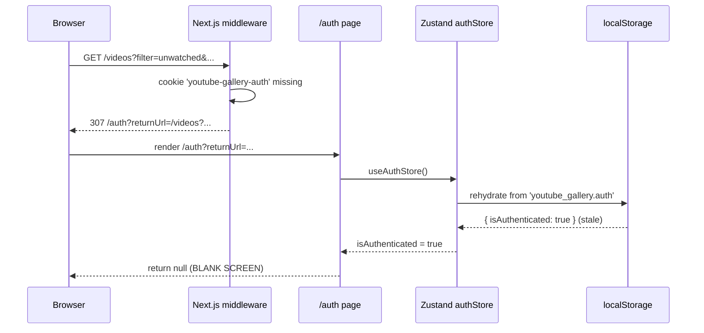

# Fix Blank `/auth` Screen on Stale Token

## Table of Contents

1. [Overview](#overview)
2. [Problem Statement](#problem-statement)
3. [Solution Overview](#solution-overview)
4. [Current System Analysis](#current-system-analysis)
5. [Technical Design](#technical-design)
6. [Implementation Phases](#implementation-phases)
7. [Performance Considerations](#performance-considerations)
8. [Testing Strategy](#testing-strategy)
9. [Risks and Mitigation](#risks-and-mitigation)
10. [Conclusion](#conclusion)

## Overview

When a user's authentication token becomes invalid while persisted client state still claims `isAuthenticated: true`, navigating to a protected route produces a blank page at `/auth?returnUrl=...` instead of the login form. This design proposes a minimal, single-file fix inside the auth route that reconciles stale client state with the server's view whenever the middleware forwards the user for re-authentication.

## Problem Statement

Users report that the screen is empty when the app redirects them to
`http://localhost:3000/auth?returnUrl=%2Fvideos%3F...`. They cannot log back in without manually clearing site data. The failure is silent: no error, no form, no fallback UI.

Pain points:

- Users believe the app is broken and abandon the session.
- The only recovery is clearing `localStorage`, which is not an action a typical user knows to take.
- Observability is poor — no telemetry fires because no component mounts past the blank guard.

## Solution Overview

Teach the auth page to treat a `returnUrl`-bearing visit as proof that the server session is gone, regardless of what the persisted client store says. Concretely:

- If the middleware sent the user (`returnUrl` present) but the store still says `isAuthenticated`, call `logout()` to drop the stale flag so the login form renders.
- If the user typed `/auth` directly while genuinely authenticated (`returnUrl` absent), redirect to `/` and show a short `Loading...` placeholder — never a blank screen.

No changes to middleware, the auth store, or the response handler are required. This keeps the fix scoped to the boundary where the truth is already known (middleware has ruled on the cookie) and avoids introducing cookie-reading logic into client-only code.

## Current System Analysis

### Flow today (stale-token case)



### Key files and lines

- [frontend/middleware.ts:12-18](../frontend/middleware.ts#L12-L18) — redirects to `/auth?returnUrl=...` when the cookie is absent. Correct; source of the trigger.
- [frontend/stores/authStore.ts:68-71](../frontend/stores/authStore.ts#L68-L71) — `partialize` persists both `user` and `isAuthenticated` to `localStorage`, so `isAuthenticated` survives cookie expiry.
- [frontend/app/auth/page.tsx:30-32](../frontend/app/auth/page.tsx#L30-L32) — `if (isAuthenticated) return null;` is the actual blank-screen line.
- [frontend/services/ResponseHandler.ts:61-72](../frontend/services/ResponseHandler.ts#L61-L72) — already calls `authStore.logout()` on 401 from API calls; but this path only runs after a fetch, not on cold navigation through middleware.
- [frontend/config/routes.ts:14](../frontend/config/routes.ts#L14) — `/auth` is a public route; middleware does not guard it, so the page always reaches render.

### Why the desync exists

- The token cookie has its own TTL and can be invalidated server-side (logout elsewhere, admin revocation, expiry). `localStorage` has no corresponding signal.
- Cookies can be cleared independently of `localStorage` (privacy extensions, devtools).
- [frontend/app/auth/components/AuthProvider.tsx](../frontend/app/auth/components/AuthProvider.tsx) handles the runtime `auth-required` event but does not react to cold loads that arrive via middleware redirect.

## Technical Design

### Scope: a single file

Only [frontend/app/auth/page.tsx](../frontend/app/auth/page.tsx) changes. No schema, no API, no serializer, no backend work. No new dependencies.

### Behavior matrix

| `returnUrl` | `isAuthenticated` (store) | Action                                     | UI                    |
| ----------- | ------------------------- | ------------------------------------------ | --------------------- |
| present     | false                     | Render login form                          | Form (unchanged)      |
| present     | true (stale)              | `logout()` effect, then render login form  | Form (was blank)      |
| absent      | true                      | `router.replace('/')` effect               | `Loading...`          |
| absent      | false                     | Render login form                          | Form (unchanged)      |

### Component sketch

```tsx
function AuthContent() {
  const searchParams = useSearchParams();
  const router = useRouter();
  const { isAuthenticated, logout } = useAuthStore();
  const [returnUrl] = useState(() => getReturnUrl(searchParams));
  const [currentView, setCurrentView] = useState<typeof AuthViews.LOGIN | typeof AuthViews.REGISTER>(AuthViews.LOGIN);

  useEffect(() => {
    if (isAuthenticated && returnUrl) {
      logout();
    }
  }, [isAuthenticated, returnUrl, logout]);

  useEffect(() => {
    if (isAuthenticated && !returnUrl) {
      router.replace('/');
    }
  }, [isAuthenticated, returnUrl, router]);

  const handleSuccess = () => router.push(returnUrl || '/');
  const handleSwitchToRegister = () => setCurrentView(AuthViews.REGISTER);
  const handleSwitchToLogin = () => setCurrentView(AuthViews.LOGIN);

  if (isAuthenticated && !returnUrl) {
    return <div className="min-h-screen bg-gray-50 flex items-center justify-center">Loading...</div>;
  }

  return (
    <div className="min-h-screen bg-gray-50 flex items-center justify-center py-12 px-4 sm:px-6 lg:px-8">
      <div className="max-w-md w-full space-y-8">
        {currentView === AuthViews.LOGIN ? (
          <LoginForm onSuccess={handleSuccess} onSwitchToRegister={handleSwitchToRegister} />
        ) : (
          <RegisterForm onSuccess={handleSuccess} onSwitchToLogin={handleSwitchToLogin} />
        )}
      </div>
    </div>
  );
}
```

Formatting follows the project's Prettier rules (single quotes, semicolons, 2-space indent, 120-char width).

### Database schema changes

None.

### Backend API design

None.

### URL state management

`returnUrl` handling remains as-is via existing helper [frontend/utils/urlHelpers.ts](../frontend/utils/urlHelpers.ts) (`getReturnUrl`). The post-login redirect already honors it.

### Internationalization

No new user-facing strings. The transient `Loading...` placeholder mirrors the existing Suspense fallback text on the same page at [frontend/app/auth/page.tsx:49](../frontend/app/auth/page.tsx#L49); promoting it to an i18n key is out of scope for this bug fix and would be a separate consistency pass.

### Rejected alternatives

- **Sync cookie → store in middleware or a provider**: requires reading a potentially httpOnly cookie from JS; fragile and broader surface area.
- **Stop persisting `isAuthenticated`**: would force a fetch on every cold load to confirm auth; larger behavioral change and risks new blank states during that fetch.
- **Gate `Sidebar` on auth route**: addresses a different symptom (global sidebar data fetches) but does not fix the `return null` in the auth page itself.

## Implementation Phases

### Phase 1 — Current: Apply the auth-page fix

- Edit [frontend/app/auth/page.tsx](../frontend/app/auth/page.tsx) per the sketch above.
- Run `npm run lint` and `npm run type-check` in `frontend/`.
- Manually reproduce and verify per [Testing Strategy](#testing-strategy).

### Phase 2 — Implemented (after verification): Add unit tests

- Add unit tests for `AuthContent` covering the four cells of the behavior matrix.

## Performance Considerations

- **Database**: not applicable.
- **Frontend**: two `useEffect` hooks with primitive dependencies. No extra renders on the happy path (unauthenticated user with `returnUrl`). On the stale path, one extra render occurs after `logout()` flips the store — negligible.
- **API**: no new requests. The fix does not introduce a fetch on the auth page.

## Testing Strategy

### Backend

No backend changes → no backend tests.

### Frontend (manual, reproducible)

1. `docker-compose up --build`.
2. Log in at http://localhost:3000/auth.
3. DevTools → Application → Cookies → delete `youtube-gallery-auth`. Leave `localStorage` key `youtube_gallery` untouched.
4. Visit http://localhost:3000/videos?filter=unwatched&tags=8-bit+music+theory%2Cchannel+5%2Cyoga&tag_mode=except&not_interested_filter=exclude.
5. Expected post-fix: login form renders on `/auth?returnUrl=...`.
6. Submit credentials → user lands on the original `/videos?...` URL with filters preserved.
7. Regression: log in fresh, visit http://localhost:3000/auth directly → brief `Loading...`, then redirect to `/`.
8. Regression: fully logged-out visit to `/auth` → login form renders as before.

### Frontend (automated)

The repo has Jest + React Testing Library wired up (see `jest.config.js`). Low-cost unit tests to add alongside the fix:

- `AuthContent` with `returnUrl` + `isAuthenticated: true` → asserts `logout` is called and the login form mounts.
- `AuthContent` without `returnUrl` + `isAuthenticated: true` → asserts `router.replace('/')` is called and the `Loading...` placeholder renders.
- `AuthContent` with `isAuthenticated: false` → asserts the form renders regardless of `returnUrl`.

### Integration

Covered by manual steps 4–6 (full redirect round-trip with a live backend).

## Risks and Mitigation

| Risk                                                                                                      | Likelihood   | Impact | Mitigation                                                                                                                                                                                |
| --------------------------------------------------------------------------------------------------------- | ------------ | ------ | ----------------------------------------------------------------------------------------------------------------------------------------------------------------------------------------- |
| User legitimately authenticated visits `/auth?returnUrl=...` (e.g., a bookmarked URL) and gets logged out | Low          | Medium | Documented as intentional: a `returnUrl` implies middleware redirect, which only happens when the cookie is invalid. A legitimately logged-in user would not arrive here via middleware. |
| `useEffect` runs twice in React strict mode, calling `logout()` twice                                     | Low          | Low    | `logout()` is idempotent (just sets state); second call is a no-op.                                                                                                                      |
| Post-login redirect preserves a malicious `returnUrl`                                                     | Pre-existing | Medium | Not introduced here. `getReturnUrl` and `isAllowedReturnUrlRoute` in [frontend/config/routes.ts](../frontend/config/routes.ts) already sanitize.                                          |
| Infinite loop between middleware → auth page → store → middleware                                         | Very Low     | High   | `logout()` only flips the persisted flag; it does not navigate. The auth route is public, so middleware will not redirect it again.                                                       |

## Conclusion

A three-line behavioral shift inside [frontend/app/auth/page.tsx](../frontend/app/auth/page.tsx) — replacing one `return null` with two `useEffect`s and a non-blank placeholder — eliminates the blank-screen failure mode while preserving every existing happy path. The fix respects the existing architecture: middleware remains the authority on cookie presence, `ResponseHandler` remains the authority on runtime 401s, and the auth page becomes the reconciler when the two client-side sources of truth drift.
